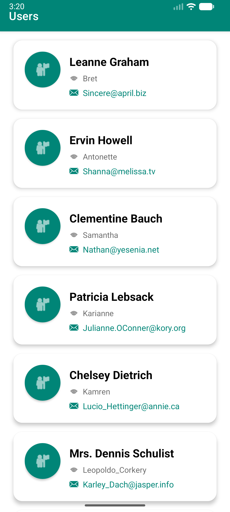

# Android RecyclerView with Data Binding, LiveData, Retrofit & MVVM

<div align="center">


A modern Android application demonstrating best practices with **MVVM Architecture**, **Data Binding**, **LiveData**, **Retrofit**, and **Hilt Dependency Injection**.

[](screenshots/home.png)

</div>

---

## 📱 Features

- ✅ **MVVM Architecture** - Clean separation of concerns following SOLID principles
- ✅ **Data Binding & View Binding** - Type-safe view references and declarative UI
- ✅ **LiveData** - Reactive data streams with lifecycle awareness
- ✅ **Retrofit** - Type-safe HTTP client for REST API communication
- ✅ **Hilt Dependency Injection** - Modern DI framework for Android
- ✅ **Material Design 3** - Beautiful, modern UI components
- ✅ **Pull-to-Refresh** - SwipeRefreshLayout for data refresh
- ✅ **Error Handling** - Comprehensive error states with retry functionality
- ✅ **Empty State** - User-friendly empty state UI
- ✅ **Loading States** - Circular progress indicators
- ✅ **RecyclerView with DiffUtil** - Efficient list updates
- ✅ **Coroutines** - Asynchronous programming support

---

## 🏗️ Architecture

This project follows the **MVVM (Model-View-ViewModel)** architecture pattern:

```
┌─────────────────────────────────────────────────────────┐
│                        UI Layer                          │
│  ┌──────────────┐  ┌──────────────┐  ┌──────────────┐  │
│  │  MainActivity │  │  UserAdapter │  │   Layouts    │  │
│  └──────┬───────┘  └──────┬───────┘  └──────┬───────┘  │
│         │                 │                  │           │
│         └─────────────────┼──────────────────┘           │
│                           │                               │
└───────────────────────────┼───────────────────────────────┘
                            │
┌───────────────────────────┼───────────────────────────────┐
│                    ViewModel Layer                         │
│                           │                               │
│                  ┌─────────▼─────────┐                     │
│                  │   UserViewModel   │                     │
│                  │   (LiveData)     │                     │
│                  └─────────┬─────────┘                     │
└───────────────────────────┼───────────────────────────────┘
                            │
┌───────────────────────────┼───────────────────────────────┐
│                    Repository Layer                        │
│                           │                               │
│                  ┌─────────▼─────────┐                     │
│                  │  UserRepository   │                     │
│                  └─────────┬─────────┘                     │
└───────────────────────────┼───────────────────────────────┘
                            │
┌───────────────────────────┼───────────────────────────────┐
│                      Data Layer                            │
│         ┌─────────────────┼─────────────────┐              │
│         │                 │                 │              │
│  ┌──────▼──────┐  ┌──────▼──────┐  ┌─────▼──────┐       │
│  │  ApiService │  │ Retrofit API │  │   Model    │       │
│  └─────────────┘  └──────────────┘  └────────────┘       │
└───────────────────────────────────────────────────────────┘
```

### Key Components

- **Model**: `User` - Data class representing user entities
- **View**: `MainActivity`, `item_user.xml` - UI components with Data Binding
- **ViewModel**: `UserViewModel` - Manages UI-related data with LiveData
- **Repository**: `UserRepository` - Single source of truth for data
- **API**: `ApiService`, `RetroServer` - Network layer with Retrofit
- **DI**: `NetworkModule` - Hilt modules for dependency injection

---

## 🛠️ Tech Stack

### Core Technologies
- **Language**: Java 17
- **Min SDK**: 24 (Android 7.0)
- **Target SDK**: 35 (Android 15)
- **Compile SDK**: 35
- **Gradle**: 8.13.1
- **Kotlin**: 2.0.21 (for build scripts)

### Libraries & Frameworks

#### Architecture Components
- `androidx.lifecycle:lifecycle-viewmodel` - ViewModel support
- `androidx.lifecycle:lifecycle-livedata` - LiveData reactive streams
- `androidx.lifecycle:lifecycle-runtime` - Lifecycle-aware components

#### UI Components
- `com.google.android.material:material` - Material Design 3 components
- `androidx.recyclerview:recyclerview` - RecyclerView for lists
- `androidx.cardview:cardview` - Material CardView
- `androidx.swiperefreshlayout` - Pull-to-refresh functionality
- `androidx.constraintlayout:constraintlayout` - Flexible layouts

#### Networking
- `com.squareup.retrofit2:retrofit` - Type-safe HTTP client
- `com.squareup.retrofit2:converter-gson` - JSON converter
- `com.squareup.okhttp3:okhttp` - HTTP client
- `com.squareup.okhttp3:logging-interceptor` - Network logging
- `com.google.code.gson:gson` - JSON serialization

#### Dependency Injection
- `com.google.dagger:hilt-android` - Hilt DI framework
- `com.google.dagger:hilt-compiler` - Hilt annotation processor

#### Asynchronous Programming
- `org.jetbrains.kotlinx:kotlinx-coroutines-core` - Coroutines support
- `org.jetbrains.kotlinx:kotlinx-coroutines-android` - Android coroutines

#### Data Binding
- Android Data Binding - Declarative UI binding
- View Binding - Type-safe view references

---

## 📦 Project Structure

```
app/src/main/java/me/mehadih/retrofitlivedatamvvmrecyclerviewdatabinding/
│
├── adapter/
│   ├── UserAdapter.java          # RecyclerView adapter with DiffUtil
│   └── UserDiffCallback.java     # DiffUtil callback for efficient updates
│
├── api/
│   ├── ApiService.java           # API service wrapper
│   ├── ApiRequestData.java      # Retrofit interface
│   └── RetroServer.java          # Retrofit client setup
│
├── di/
│   └── NetworkModule.java        # Hilt module for network dependencies
│
├── handler/
│   └── ItemUserClickHandler.java # Click handler interface
│
├── model/
│   └── User.java                 # User data model
│
├── repository/
│   └── UserRepository.java       # Repository pattern implementation
│
├── util/
│   └── Result.java               # Result wrapper for error handling
│
├── viewmodel/
│   └── UserViewModel.java        # ViewModel with LiveData
│
├── MainActivity.java              # Main activity with MVVM setup
└── MyApplication.java             # Application class with Hilt

app/src/main/res/
├── layout/
│   ├── activity_main.xml         # Main activity layout
│   └── item_user.xml             # RecyclerView item layout (with Data Binding)
├── values/
│   ├── colors.xml                # Color resources
│   ├── strings.xml               # String resources
│   └── styles.xml                # Theme and styles
└── xml/
    └── network_security_config.xml # Network security configuration
```

---

## 🚀 Getting Started

### Prerequisites

- **Android Studio** Hedgehog (2023.1.1) or later
- **JDK 17** or later
- **Android SDK** with API level 35
- **Gradle** 8.13.1 or compatible version

### Installation

1. **Clone the repository**
   ```bash
   git clone https://github.com/mehadi/Android-RecyclerView-with-Data-Binding-LiveData-Retrofit-MVVM.git
   cd Android-RecyclerView-with-Data-Binding-LiveData-Retrofit-MVVM
   ```

2. **Open in Android Studio**
   - Open Android Studio
   - Select `File` → `Open`
   - Navigate to the cloned directory
   - Click `OK`

3. **Sync Gradle**
   - Android Studio will automatically sync Gradle
   - Wait for dependencies to download

4. **Run the app**
   - Connect an Android device or start an emulator
   - Click the `Run` button (▶️) or press `Shift + F10`

### Build Configuration

The app uses the following API endpoint:
- **Base URL**: `https://jsonplaceholder.typicode.com/`
- **Endpoint**: `/users`

You can modify the base URL in `app/build.gradle`:
```gradle
buildConfigField "String", "BASE_URL", '"https://your-api-url.com/"'
```

---

## 📖 Usage

### Main Features

1. **View Users List**
   - The app automatically fetches and displays users from the API
   - Each user card shows: name, username, and email

2. **Pull to Refresh**
   - Swipe down on the list to refresh user data
   - Loading indicator appears during refresh

3. **Error Handling**
   - If network request fails, an error state is shown
   - Click "Retry" button to attempt fetching again

4. **Empty State**
   - If no users are available, an empty state message is displayed

5. **Item Click**
   - Tap on any user card to see a toast message with the user's name

---

## 🎨 UI/UX Features

### Modern Material Design 3
- **Card-based Layout**: Each user is displayed in a Material CardView
- **Avatar Icons**: Circular avatar placeholders with primary color
- **Icon Indicators**: Visual icons for username and email fields
- **Smooth Animations**: Ripple effects and transitions
- **Responsive Design**: Adapts to different screen sizes
- **Dark/Light Theme Support**: Follows system theme preferences

### User Item Design
- **64dp Avatar**: Circular profile icon with elevation
- **Typography Hierarchy**: Clear visual hierarchy with different text sizes
- **Color Coding**: Primary color for email, secondary for username
- **Spacing**: Consistent 16dp margins and 20dp padding
- **Touch Feedback**: Ripple effects on card interaction

---

## 🧪 Testing

The project includes test infrastructure:

- **Unit Tests**: `app/src/test/java/`
- **Instrumented Tests**: `app/src/androidTest/java/`

Run tests:
```bash
./gradlew test          # Unit tests
./gradlew connectedAndroidTest  # Instrumented tests
```

---

## 📝 Code Quality

This project follows:

- ✅ **SOLID Principles** - Single Responsibility, Open/Closed, Liskov Substitution, Interface Segregation, Dependency Inversion
- ✅ **Clean Architecture** - Separation of concerns across layers
- ✅ **Best Practices** - 2025 Android development standards
- ✅ **Null Safety** - Proper null handling with annotations
- ✅ **Error Handling** - Comprehensive error management
- ✅ **Documentation** - Well-documented code with JavaDoc comments

---

## 🔧 Configuration

### Network Security

The app includes network security configuration (`network_security_config.xml`) to ensure secure network communication.

### ProGuard

For release builds, configure ProGuard rules in `app/proguard-rules.pro`.

---

## 📄 API Information

This app uses the [JSONPlaceholder](https://jsonplaceholder.typicode.com/) API for demonstration purposes.

**Endpoint**: `GET https://jsonplaceholder.typicode.com/users`

**Response Format**:
```json
[
  {
    "id": 1,
    "name": "Leanne Graham",
    "username": "Bret",
    "email": "Sincere@april.biz"
  }
]
```

---

## 🤝 Contributing

Contributions are welcome! Please feel free to submit a Pull Request.

1. Fork the repository
2. Create your feature branch (`git checkout -b feature/AmazingFeature`)
3. Commit your changes (`git commit -m 'Add some AmazingFeature'`)
4. Push to the branch (`git push origin feature/AmazingFeature`)
5. Open a Pull Request

---

## 📄 License

This project is open source and available under the [MIT License](LICENSE).

---

## 👤 Author

**Mehadi**

- Website: [mehadi.me](http://mehadi.me)
- GitHub: [@mehadi](https://github.com/mehadi)

---

## 🙏 Acknowledgments

- [JSONPlaceholder](https://jsonplaceholder.typicode.com/) for providing a free API for testing
- Android Jetpack team for excellent architecture components
- Material Design team for beautiful UI components

---

## 📊 Project Stats


---

<div align="center">

**⭐ If you find this project helpful, please give it a star! ⭐**

Made with ❤️ by [Mehadi](http://mehadi.me)

</div>
