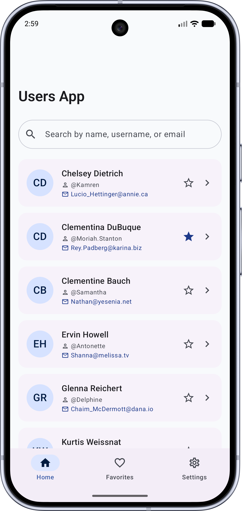
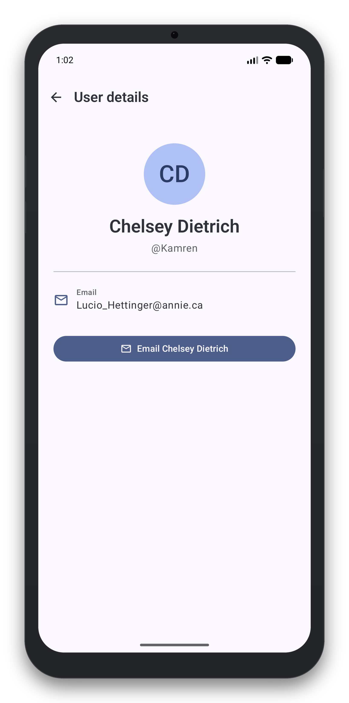

# Users App — Jetpack Compose, Clean Architecture, Offline-First

<div align="center">


A modern Android application demonstrating **Jetpack Compose**, **Clean Architecture** (domain/data/presentation), **MVVM** with `StateFlow`, an **offline-first Room cache**, **Retrofit + Coroutines**, **Hilt DI**, **DataStore Preferences**, and **Material Design 3** — with onboarding, search, favorites, and a settings screen on top of a browse/detail flow.

<table>
<tr>
<td></td>
<td></td>
</tr>
</table>

</div>

---

## 📱 Features

- ✅ **100% Jetpack Compose** — no XML layouts, no View/Data Binding
- ✅ **Clean Architecture** — `domain` / `data` / `presentation` layers, one-way dependency flow
- ✅ **MVVM with `StateFlow`** — lifecycle-aware, testable UI state, no `LiveData`
- ✅ **Offline-first** — Room is the single source of truth; the list stays available with no network, and a failed refresh never wipes the cache
- ✅ **Onboarding** — a 3-page first-run flow, shown once and remembered via DataStore
- ✅ **Search** — instant, client-side filtering of the user list by name, username, or email
- ✅ **Favorites** — toggle any user as a favorite from the list, detail, or a dedicated Favorites tab; favorites survive a pull-to-refresh
- ✅ **Settings** — Light/Dark/System theme picker, Material You dynamic color toggle (Android 12+), clear-cache action, app info
- ✅ **Bottom navigation** — Home / Favorites / Settings, hidden on Onboarding and Detail
- ✅ **Retrofit + Coroutines** — suspend functions, no manual `ExecutorService`/`Future` plumbing
- ✅ **Hilt Dependency Injection** — constructor injection across every layer
- ✅ **Material Design 3** — dynamic color (Android 12+), a hand-tuned light/dark fallback palette, custom type & shape scale, an 8dp spacing scale
- ✅ **Navigation Compose** — conditional start destination (onboarding vs. home), list → detail, tab navigation
- ✅ **Pull-to-refresh & skeleton loading** — Material 3 `PullToRefreshBox` plus a shimmer placeholder while the first load is in flight
- ✅ **Loading / Empty / Error / No-results states** — full-screen states when there's no cache, a dismissible snackbar when there is, a dedicated empty state for an unmatched search
- ✅ **Splash screen & edge-to-edge** — `androidx.core.splashscreen`, gated on the initial preferences read, insets-aware layout throughout
- ✅ **Accessibility** — content descriptions on every icon/image, 48dp+ touch targets, live-region announcements for the onboarding pager, semantic merging on list rows
- ✅ **Unit + Compose UI tests** — repository and ViewModel tests, plus a screen-level Compose test

---

## 🏗️ Architecture

The app follows **Clean Architecture**, layered as plain Kotlin packages inside a single `:app` module:

```
┌────────────────────────────────────────────────────────────────────────────┐
│                              presentation/                                 │
│  ┌───────────┐ ┌──────────┐ ┌───────────┐ ┌──────────┐ ┌─────────────────┐ │
│  │ onboarding│ │ userlist │ │ userdetail│ │ favorites│ │ settings        │ │
│  │ Screen+VM │ │ Screen+VM│ │ Screen+VM │ │ Screen+VM│ │ Screen+VM       │ │
│  └─────┬─────┘ └────┬─────┘ └─────┬─────┘ └────┬─────┘ └────────┬────────┘ │
│        │            │  StateFlow<UiState>      │                │         │
│        └────────────┴─────────────┬────────────┴────────────────┘         │
│                          navigation/ (AppNavHost, bottom nav, MainActivityVM)│
└──────────────────────────────────┬──────────────────────────────────────────┘
                                    │
┌───────────────────────────────────┼──────────────────────────────────────────┐
│                                domain/                                       │
│  ObserveUsersUseCase · ObserveUserByIdUseCase · RefreshUsersUseCase          │
│  ObserveFavoriteUsersUseCase · ToggleFavoriteUseCase · ClearCacheUseCase      │
│  UserRepository (interface) · UserPreferencesRepository (interface) · User    │
└──────────────────────────────────┬────────────────────────────────────────────┘
                                   │ implements
┌──────────────────────────────────┼────────────────────────────────────────────┐
│                                data/                                          │
│  UserRepositoryImpl ── observes ──▶ UserDao (Room, source of truth)           │
│         │                                                                      │
│         └── refresh() ──▶ UserApi (Retrofit) ──▶ writes through to Room       │
│                            (preserves isFavorite across refreshes)            │
│  UserPreferencesRepositoryImpl ── backed by ──▶ DataStore<Preferences>        │
└──────────────────────────────────────────────────────────────────────────────┘
```

**Why Room is the source of truth:** the UI never talks to the network directly. `UserRepository.observeUsers()` streams from Room, so the list renders instantly from cache — even fully offline. `refresh()` is the only network call; on success it writes the fresh data into Room (which the UI observes automatically) while preserving each user's favorite flag, and on failure it reports the error without touching the existing cache.

**Why preferences get their own repository:** theme mode, dynamic color, and the onboarding-seen flag are user preferences, not user *data* — they're modeled as a separate `UserPreferencesRepository` backed by DataStore, kept independent of the Room-backed `UserRepository`.

### Key Components

- **Domain**: [`User`](app/src/main/java/me/mehadi/retrofitlivedatamvvmrecyclerviewdatabinding/domain/model/User.kt), [`ThemeMode`](app/src/main/java/me/mehadi/retrofitlivedatamvvmrecyclerviewdatabinding/domain/model/ThemeMode.kt), [`UserRepository`](app/src/main/java/me/mehadi/retrofitlivedatamvvmrecyclerviewdatabinding/domain/repository/UserRepository.kt), [`UserPreferencesRepository`](app/src/main/java/me/mehadi/retrofitlivedatamvvmrecyclerviewdatabinding/domain/repository/UserPreferencesRepository.kt), use cases in `domain/usecase/`
- **Data**: [`UserRepositoryImpl`](app/src/main/java/me/mehadi/retrofitlivedatamvvmrecyclerviewdatabinding/data/repository/UserRepositoryImpl.kt), [`UserPreferencesRepositoryImpl`](app/src/main/java/me/mehadi/retrofitlivedatamvvmrecyclerviewdatabinding/data/repository/UserPreferencesRepositoryImpl.kt), [`UserDao`](app/src/main/java/me/mehadi/retrofitlivedatamvvmrecyclerviewdatabinding/data/local/UserDao.kt)/`AppDatabase` (Room), [`UserPreferencesDataSource`](app/src/main/java/me/mehadi/retrofitlivedatamvvmrecyclerviewdatabinding/data/local/datastore/UserPreferencesDataSource.kt) (DataStore), [`UserApi`](app/src/main/java/me/mehadi/retrofitlivedatamvvmrecyclerviewdatabinding/data/remote/UserApi.kt) (Retrofit), Hilt modules in `data/di/`
- **Presentation**: [`OnboardingScreen`](app/src/main/java/me/mehadi/retrofitlivedatamvvmrecyclerviewdatabinding/presentation/onboarding/OnboardingScreen.kt), [`UserListScreen`](app/src/main/java/me/mehadi/retrofitlivedatamvvmrecyclerviewdatabinding/presentation/userlist/UserListScreen.kt) + `UserListViewModel`, [`UserDetailScreen`](app/src/main/java/me/mehadi/retrofitlivedatamvvmrecyclerviewdatabinding/presentation/userdetail/UserDetailScreen.kt) + `UserDetailViewModel`, [`FavoritesScreen`](app/src/main/java/me/mehadi/retrofitlivedatamvvmrecyclerviewdatabinding/presentation/favorites/FavoritesScreen.kt), [`SettingsScreen`](app/src/main/java/me/mehadi/retrofitlivedatamvvmrecyclerviewdatabinding/presentation/settings/SettingsScreen.kt), [`AppNavHost`](app/src/main/java/me/mehadi/retrofitlivedatamvvmrecyclerviewdatabinding/presentation/navigation/AppNavHost.kt) + `MainActivityViewModel` (bottom nav + conditional start destination), MD3 theme + `Spacing`/`Motion` tokens in `presentation/theme/`
- **Entry points**: [`MainActivity`](app/src/main/java/me/mehadi/retrofitlivedatamvvmrecyclerviewdatabinding/MainActivity.kt) (single `ComponentActivity`, splash gated on the initial preferences read, edge-to-edge, Compose host), `MyApplication` (`@HiltAndroidApp`)

---

## 🛠️ Tech Stack

### Core
- **Language**: Kotlin (100% — no Java sources)
- **UI Toolkit**: Jetpack Compose + Material 3
- **Min SDK**: 24 (Android 7.0) · **Target SDK**: 36 · **Compile SDK**: 37
- **Build**: Gradle 9.4.1 + AGP 9.2.1, versions managed via `gradle/libs.versions.toml`
- **Annotation processing**: KSP (Hilt + Room), no `kapt`

### Libraries
| Category | Libraries |
|---|---|
| UI | Compose BOM, Material 3, Navigation Compose, `core-splashscreen`, Material Icons Extended |
| Architecture | ViewModel + `lifecycle-runtime-compose`, Hilt, `hilt-navigation-compose` |
| Offline cache | Room (`room-runtime`, `room-ktx`, KSP compiler) |
| Local preferences | DataStore Preferences (theme mode, dynamic color, onboarding-seen) |
| Networking | Retrofit, OkHttp + logging interceptor, Gson |
| Async | Kotlinx Coroutines |
| Testing | JUnit4, `kotlinx-coroutines-test`, `androidx.arch.core:core-testing`, Compose UI Test, Espresso, Hilt testing |

Exact versions live in [`gradle/libs.versions.toml`](gradle/libs.versions.toml).

---

## 📦 Project Structure

```
app/src/main/java/me/mehadi/retrofitlivedatamvvmrecyclerviewdatabinding/
├── domain/
│   ├── model/              User.kt · ThemeMode.kt
│   ├── repository/         UserRepository.kt · UserPreferencesRepository.kt
│   └── usecase/            ObserveUsersUseCase · ObserveUserByIdUseCase · RefreshUsersUseCase
│                            ObserveFavoriteUsersUseCase · ToggleFavoriteUseCase · ClearCacheUseCase
│
├── data/
│   ├── remote/             UserApi (Retrofit) · dto/UserDto.kt
│   ├── local/               UserEntity · UserDao · AppDatabase (Room) · datastore/UserPreferencesDataSource.kt
│   ├── repository/         UserRepositoryImpl.kt · UserPreferencesRepositoryImpl.kt
│   └── di/                 NetworkModule · DatabaseModule · RepositoryModule (Hilt)
│
├── presentation/
│   ├── theme/               Color.kt · Type.kt · Shape.kt · Spacing.kt · Motion.kt · Theme.kt (Material 3)
│   ├── components/         UserAvatar.kt (shared)
│   ├── navigation/          AppNavHost.kt · MainActivityViewModel · MainActivityUiState (bottom nav + start destination)
│   ├── onboarding/         OnboardingScreen · OnboardingViewModel
│   ├── userlist/            UserListScreen · UserListViewModel · UserListUiState · components/ (search, favorite toggle, shimmer)
│   ├── userdetail/         UserDetailScreen · UserDetailViewModel · UserDetailUiState
│   ├── favorites/          FavoritesScreen · FavoritesViewModel · FavoritesUiState
│   └── settings/           SettingsScreen · SettingsViewModel · SettingsUiState
│
├── MainActivity.kt         Single ComponentActivity — splash, edge-to-edge, Compose host
└── MyApplication.kt        @HiltAndroidApp

app/src/main/res/
├── values/                 strings.xml · colors.xml (splash) · themes.xml
├── values-night/           dark-mode overrides
└── xml/network_security_config.xml

app/src/test/java/…        UserRepositoryImplTest · UserListViewModelTest (+ fakes)
app/src/androidTest/java/… UserListScreenTest (Compose UI test)
```

---

## 🚀 Getting Started

### Prerequisites

- **Android Studio** (latest stable)
- **JDK 17+**
- **Android SDK Platform 37** (compile) — Gradle will prompt to install it if missing
- **Gradle** 9.4.1 (via the included wrapper — no local install needed)

### Installation

1. **Clone the repository**
   ```bash
   git clone https://github.com/mehadi/Android-RecyclerView-with-Data-Binding-LiveData-Retrofit-MVVM.git
   cd Android-RecyclerView-with-Data-Binding-LiveData-Retrofit-MVVM
   ```

2. **Open in Android Studio** and let it sync Gradle, or build from the CLI:
   ```bash
   ./gradlew assembleDebug
   ```

3. **Run the app**
   - Connect a device or start an emulator, then click ▶️ Run in Android Studio, or:
   ```bash
   ./gradlew installDebug
   ```

### Build Configuration

The app targets the [JSONPlaceholder](https://jsonplaceholder.typicode.com/) API:

- **Base URL**: `https://jsonplaceholder.typicode.com/`
- **Endpoint**: `GET /users`

Change it in `app/build.gradle`:
```groovy
buildConfigField "String", "BASE_URL", '"https://your-api-url.com/"'
```

---

## 📖 Usage

1. **First launch** — a 3-page onboarding flow introduces the app; Skip or Get Started dismisses it for good (remembered via DataStore).
2. **Browse users** — the list loads from the network on first launch and is cached locally with Room; a shimmer placeholder shows while the very first load is in flight.
3. **Search** — type in the search field to filter the list by name, username, or email; a dedicated empty state appears if nothing matches.
4. **Favorite a user** — tap the star on any list row or on the detail screen; favorites are also reachable from the **Favorites** tab and survive a pull-to-refresh.
5. **Pull to refresh** — swipe down on Home to re-fetch; cached content stays visible while refreshing.
6. **Tap a user** — opens a detail screen with avatar, name, username, and (when present) email, phone, website, and company — with **Email**, **Call**, and **Website** actions that launch the corresponding device app.
7. **Settings tab** — pick Light/Dark/System theme, toggle Material You dynamic color (Android 12+), clear the local cache, or check the app version.
8. **Go offline** — turn off Wi-Fi/mobile data and relaunch: the cached list still renders instantly, with a non-blocking snackbar reporting the refresh failure.
9. **Errors with no cache** — a full-screen error state with a **Retry** button is shown only when there's nothing cached to fall back to.

---

## 🎨 UI/UX

- **Material 3** throughout — dynamic color on Android 12+ (toggleable in Settings), a hand-tuned fallback palette (light + dark) otherwise
- **Initials avatars** — tonal, `primaryContainer`-backed circles; no image loader dependency needed
- **8dp spacing scale & motion tokens** — `Spacing.kt` and `Motion.kt` keep layout and animation timing consistent across all five screens
- **Motion** — collapsing top app bar, per-item list entrance animation (`Modifier.animateItem()`), Material 3 pull-to-refresh, onboarding pager transitions, fade/slide detail content entrance
- **States** — dedicated loading / empty / no-results / full-screen-error composables, each independently testable
- **Accessibility** — every icon has a content description (or is explicitly marked decorative), 48dp+ touch targets, live-region page announcements on the onboarding pager, list rows expose a single merged semantic label for screen readers

---

## 🧪 Testing

```bash
./gradlew testDebugUnitTest          # Unit tests: repository + ViewModel
./gradlew connectedDebugAndroidTest  # Instrumented Compose UI tests (needs a device/emulator)
./gradlew lintDebug                  # Static analysis
```

- **`UserRepositoryImplTest`** — cache-first emission, a failed refresh doesn't clear the cache, stale users are evicted on refresh
- **`UserListViewModelTest`** — loading/success/error state transitions, using fake `UserRepository` + `kotlinx-coroutines-test`
- **`UserListScreenTest`** — renders the stateless screen composable against fixture UI states (loaded/empty/error/loading)

> The newer onboarding, favorites, and settings screens don't have dedicated automated tests yet — a good next contribution if you're looking for one.

---

## 📝 Code Quality

- ✅ **Clean Architecture** — `domain` has no Android/framework dependencies; `data` and `presentation` depend inward on it, never sideways
- ✅ **SOLID** — repositories are hidden behind interfaces (`UserRepository`, `UserPreferencesRepository`), use cases are single-purpose, DI wires everything via Hilt
- ✅ **Single source of truth** — Room, not the network, is what the UI observes; DataStore is the single source of truth for preferences
- ✅ **Kotlin idioms** — `sealed`/`data class`es, `Flow`/`StateFlow`, `Result<T>` for fallible operations, no platform `!!` or nullable-Java carryover
- ✅ **R8/ProGuard** — `minifyEnabled` + `shrinkResources` enabled for release builds
- ✅ **Use-case naming reflects behavior** — the two `Flow`-returning use cases are named `ObserveUsersUseCase` / `ObserveUserByIdUseCase` (previously `Get*`, which implied a one-shot fetch), consistent with `ObserveFavoriteUsersUseCase`

### DI/Architecture audit (Aug 2026)

A full audit of the Hilt setup and layer boundaries — every ViewModel, repository binding, module scope, and use case — found the DI graph and Clean Architecture split already correct: constructor injection throughout, repositories bound via `@Binds` to interfaces, `@Singleton` limited to genuinely stateful/expensive types (Room `AppDatabase`, `Retrofit`/`OkHttpClient`, the two repository impls, the DataStore data source), and use cases correctly left unscoped as stateless wrappers. Two findings came out of it:

- **Fixed** — the `Get*UseCase` naming above was corrected to `Observe*UseCase` (rename only; no behavior change), including the associated KDoc cross-references and the one test constructing `UserListViewModel`.
- **Documented, not restructured** — `SettingsViewModel`, `OnboardingViewModel`, and `MainActivityViewModel` inject `UserPreferencesRepository` directly rather than through a use case. This is intentional: those are single-field preference reads/writes with no business rule to encapsulate, unlike favorites-toggling or cache-clearing. The rule is now spelled out in the KDoc on [`UserPreferencesRepository`](app/src/main/java/me/mehadi/retrofitlivedatamvvmrecyclerviewdatabinding/domain/repository/UserPreferencesRepository.kt) rather than papered over with thin pass-through use-case wrappers that would add indirection without a real benefit.

No other DI/architecture issues were found. One unrelated, pre-existing gap was also fixed while touching this area: `UserListViewModelTest`'s `createViewModel()` helper was missing the `toggleFavoriteUseCase` constructor argument (the test file didn't compile).

---

## 🔧 Configuration

### Network Security

`network_security_config.xml` disallows cleartext traffic and pins to the JSONPlaceholder domain only.

### ProGuard / R8

Release builds are minified and resource-shrunk; rules live in `app/proguard-rules.pro`.

---

## 📄 API Information

This app uses the [JSONPlaceholder](https://jsonplaceholder.typicode.com/) API for demonstration purposes.

**Endpoint**: `GET https://jsonplaceholder.typicode.com/users`

**Response fields used**: `id`, `name`, `username`, `email`, `phone`, `website`, and `company.name` (surfaced on the detail screen when present). `isFavorite` is a purely local flag stored in the Room cache — it isn't part of the API response.

```json
[
  {
    "id": 1,
    "name": "Leanne Graham",
    "username": "Bret",
    "email": "Sincere@april.biz",
    "phone": "1-770-736-8031 x56442",
    "website": "hildegard.org",
    "company": { "name": "Romaguera-Crona" }
  }
]
```

---

## 🤝 Contributing

Contributions are welcome! Please feel free to submit a Pull Request.

1. Fork the repository
2. Create your feature branch (`git checkout -b feature/AmazingFeature`)
3. Commit your changes (`git commit -m 'Add some AmazingFeature'`)
4. Push to the branch (`git push origin feature/AmazingFeature`)
5. Open a Pull Request

---

## 📄 License

This project is open source and available under the [MIT License](LICENSE).

---

## 👤 Author

**Mehadi**

- Website: [mehadi.me](http://mehadi.me)
- GitHub: [@mehadi](https://github.com/mehadi)

---

## 🙏 Acknowledgments

- [JSONPlaceholder](https://jsonplaceholder.typicode.com/) for providing a free API for testing
- Android Jetpack team for excellent architecture components
- Material Design team for beautiful UI components

---

## 📊 Project Stats


---

<div align="center">

**⭐ If you find this project helpful, please give it a star! ⭐**

Made with ❤️ by [Mehadi](http://mehadi.me)

</div>
